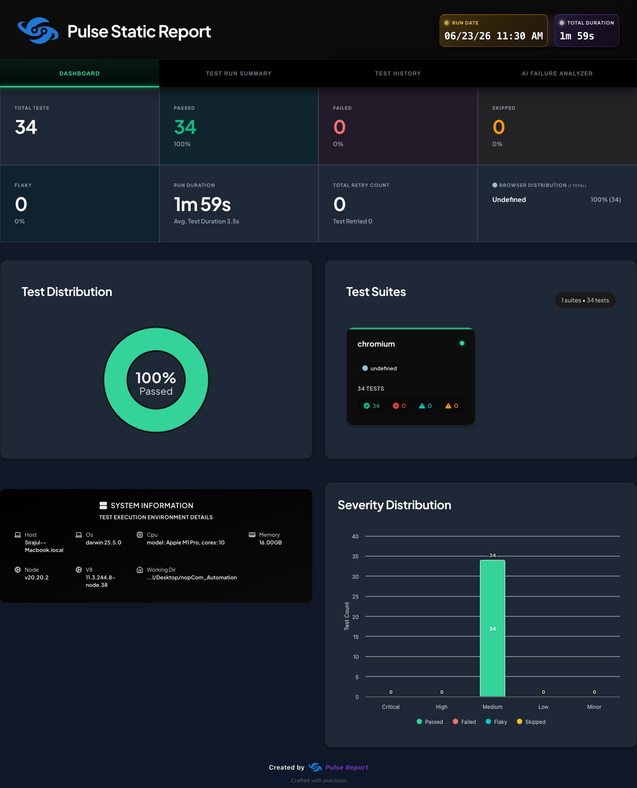

<div align="center">

# 🛒 nopCommerce — Playwright Automation Framework

### End-to-end UI automation for [demo.nopcommerce.com](https://demo.nopcommerce.com/) — built like production, not a demo.


A **Page Object Model** test framework on Playwright + TypeScript, with
**data-driven** cases, **hybrid API setup**, **HTML + Pulse** reporting, and a
real **Cloudflare bypass** — covering **9 features in 34 tests**.

<br>



<sub><i>Playwright Pulse dashboard — 34/34 passing, 0 failed, 0 flaky.</i></sub>

</div>

---

## ✨ Highlights

- 🧱 **True framework, not a flat script pile** — POM page objects, custom fixtures, a data layer, and reusable utils. Specs read as *intent*; selectors live in page objects.
- 🎯 **Pass / Fail / Edge for every feature** — happy paths *and* negative + boundary cases. Negative tests pass by **proving the app rejects bad input**.
- 🔁 **3 full E2E checkout journeys** — as a **guest**, a **logged-in user**, and **register → buy** in one session.
- 🧬 **Data-driven** — registration profiles, invalid-login sets, and search keywords come from JSON, not hardcoded copies.
- ⚡ **Hybrid setup** — accounts are created via an **API form-POST** (fast, stable) while features are verified through the **UI**.
- 🛡️ **Solves real Cloudflare defenses** — headless block **and** Rocket Loader handler-gating (most naive suites silently no-op here).
- 📊 **Dual reporting** — built-in Playwright HTML **+** the Playwright Pulse dashboard with trend history.
- 🔬 **Proven stable** — passes **34/34 with `--retries=0`** (no retry masking).

---

## 📈 At a glance

| | |
|---|---|
| **App under test** | https://demo.nopcommerce.com/ |
| **Stack** | Playwright · TypeScript · Page Object Model |
| **Features automated** | **9** (8 core + end-to-end checkout) |
| **Executed tests** | **34** (Pass / Fail / Edge, several data-driven) |
| **Page objects** | 9 (`BasePage` + 8 feature pages) |
| **Reporting** | Playwright HTML + Playwright Pulse (trends) |
| **Evidence on failure** | screenshot · trace · video |
| **Latest result** | `34 passed` — and `34/34` again at `--retries=0` |

---

## 🚀 Quick start

```bash
# 1. Install
npm install
npx playwright install chromium      # first time only

# 2. Run everything
npm test

# 3. See the report
npm run report
```

> ⚠️ Tests run **headed** on purpose — the demo store is behind Cloudflare, which
> blocks headless browsers. Each parallel worker opens one Chrome window
> (default **2**). See [Beating Cloudflare](#-engineering-highlights--hard-problems-solved).

---

## ✅ What's automated

| # | Feature | Spec | Pass · Fail · Edge |
|---|---------|------|--------------------|
| 1 | **User Registration** | `registration.spec.ts` | valid sign-up *(data-driven ×2)* · duplicate email · invalid fields |
| 2 | **Login** | `login.spec.ts` | valid login · invalid sets *(data-driven ×3)* · wrong password |
| 3 | **Product Search** | `search.spec.ts` | keywords *(data-driven ×3)* · no results · below min length |
| 4 | **Add to Cart** | `addToCart.spec.ts` | add product · invalid coupon · quantity update |
| 5 | **Wishlist** | `wishlist.spec.ts` | add to wishlist · empty state · move to cart |
| 6 | **Currency Change** | `currency.spec.ts` | switch to Euro · constrained options · persists on nav |
| 7 | **Newsletter** | `newsletter.spec.ts` | valid email · malformed email · empty email |
| 8 | **Contact Us** | `contactUs.spec.ts` | valid enquiry · invalid email · long body |
| 9 | **E2E Checkout** | `e2e-checkout.spec.ts` | **guest** · **logged-in user** · **register→buy** · empty-cart blocked · ToS gate |

📋 Full scenario tables (Precondition / Steps / Expected Result) → [`docs/Step2-Test-Scenarios.md`](docs/Step2-Test-Scenarios.md)
🗂️ Feature selection & business/QA justification → [`docs/Step1-Identify-Key-Areas.md`](docs/Step1-Identify-Key-Areas.md)

---

## 🏗️ Architecture

```
nopCom_Automation/
├── pages/                       # 🧱 Page Object Model — selectors + actions
│   ├── BasePage.ts              #   shared header/footer + Cloudflare-ready navigation
│   ├── RegisterPage.ts  LoginPage.ts  SearchPage.ts  ProductPage.ts
│   ├── CartPage.ts  WishlistPage.ts  ContactPage.ts
│   └── CheckoutPage.ts          #   one-page checkout wizard (resilient stepper)
├── tests/                       # 🧪 The test suite (intent only, no raw selectors)
│   ├── data/                    #   🧬 data-driven inputs (users.json, search.json)
│   ├── *.spec.ts                #   8 feature specs
│   └── e2e-checkout.spec.ts     #   3 end-to-end journeys + negative/edge
├── utils/                       # 🔧 Framework plumbing
│   ├── fixtures.ts              #   worker-scoped `account` fixture
│   ├── api.ts                   #   hybrid API account creation (form POST)
│   └── helpers.ts               #   unique data generators
├── docs/                        # 📄 Step 1 & Step 2 deliverables
├── playwright.config.ts         # ⚙️  Cloudflare/headed config, reporters, retries
└── tsconfig.json
```

**The framework layer** (`pages/`, `utils/`, config) is reusable scaffolding with
**zero tests** — you could add 100 new specs without touching it. **The suite**
(`tests/`) expresses *what* to verify, never *how* to find elements.

---

## 🧠 Engineering highlights — hard problems solved

This is where the framework earns its name. The demo store actively fights
automation; naive suites fail silently here.

<details open>
<summary><b>🛡️ Beating Cloudflare (headless block + Rocket Loader)</b></summary>

<br>

**Problem 1 — headless is blocked.** Cloudflare's "Just a moment…" / "Performing
security verification" challenge never clears for a headless browser.
**Solution:** run **headed**, disable the automation flag
(`--disable-blink-features=AutomationControlled`), and use the **native** user
agent (a mismatched UA keeps the challenge looping). Verified empirically across
launch configs.

**Problem 2 — clicks silently no-op.** Cloudflare **Rocket Loader** defers every
inline `onclick` behind `window.__cfRLUnblockHandlers`. Before that flag flips,
Add-to-cart / Login / currency / newsletter clicks do *nothing* — and the test
just sees "no result." **Solution:** `BasePage.waitForStoreReady()` waits for the
flag before any interaction, so handlers are always live.

**Problem 3 — the slow challenge flakes.** The harder "security verification"
sometimes takes >30s. **Solution:** wait patiently *before* reloading (reloading
mid-challenge resets it) with a 120s test budget.

</details>

<details>
<summary><b>⚡ Hybrid API setup — fast, stable account creation</b></summary>

<br>

Login/checkout tests need a real account, but registering through the UI for
every run is slow and flaky. `utils/api.ts` creates the account via a
**form POST** to `/register` (reusing the browser's Cloudflare + anti-forgery
cookies), then the **UI** verifies the feature. Classic *"set up via API, assert
via UI."* The account fixture is **worker-scoped** — created once per worker, so
tests stay independent of any pre-seeded demo data.

</details>

<details>
<summary><b>🧩 Resilient one-page-checkout stepper</b></summary>

<br>

Checkout is an AJAX wizard whose steps vary (a logged-in user with no saved
address gets an extra shipping step a guest doesn't). Instead of a brittle fixed
sequence, `CheckoutPage.completeOrder()` **loops and clicks whichever step is
currently active** until the order confirms — and waits out a **state-dropdown
AJAX race** that otherwise resets the selection and blocks billing.

</details>

<details>
<summary><b>🎯 Real test oracles</b></summary>

<br>

Every test asserts a concrete expected result — *specified-output* (exact
messages), *state-transition* (cart counter +1, logged-in state), and *negative*
oracles (the bad thing did **not** happen). No test passes just because "nothing
threw."

</details>

---

## 📊 Reporting

Two complementary reports:

**1 · Playwright HTML** — auto-generated in `playwright-report/`.
```bash
npm run report          # opens the last HTML report
```

**2 · Playwright Pulse** — interactive dashboard with **trend analytics**.
```bash
npm test                # writes pulse-report/playwright-pulse-report.json
npm run report:pulse    # -> playwright-pulse-static-report.html (self-contained)
```
> 🔎 The Pulse report mirrors the **last** run — always run the **full** suite
> before generating it, or it shows only the subset you ran.

On **failure**, each test attaches a **screenshot**, a **trace**
(`npx playwright show-trace …`), and a **video**.

---

## ▶️ How to run the framework

> **Prerequisite:** Node.js **18+**. One-time setup: `npm install && npx playwright install chromium`.

### 1 · Run everything
```bash
npm test
```
Runs all **34 tests** headed (2 workers → 2 Chrome windows). Generates the HTML
report in `playwright-report/` and the Pulse JSON in `pulse-report/`.

### 2 · Run a subset
```bash
npx playwright test login.spec.ts                 # one feature file
npx playwright test login currency search         # several features
npx playwright test -g "GUEST can search"         # one scenario by title (-g)
npx playwright test e2e-checkout.spec.ts          # all checkout journeys
```
> Prefer `-g "<title>"` over a line number — titles don't shift when files change.

### 3 · Control the windows / speed
```bash
npx playwright test --workers=1     # a single Chrome window (cleanest)
npx playwright test --workers=4     # faster, 4 windows
npm run test:ui                     # Playwright UI mode — pick & inspect tests
npm run test:headed                 # explicitly headed
```

### 4 · Re-run only what failed
```bash
npm run test:retry-failed           # = playwright test --last-failed
```

### 5 · Slow / demo mode (for screen recording)
```bash
npm run test:slow                                  # 10s per step, full-screen, video on
STEP_DELAY=10000 npx playwright test -g "GUEST can search"   # record one journey
STEP_DELAY=5000  npx playwright test -g "REGISTER then"      # 5s per step (faster)
```
`STEP_DELAY=<ms>` pauses after each logical step (even pacing), opens a large
**1680×1000** window so it fills the screen, records full-resolution video, and
uses a single window. Normal runs are unaffected.

### 6 · See the reports
```bash
npm run report          # open the Playwright HTML report
npm run report:pulse    # build the Pulse dashboard (pulse-report/*.html)
```

### 7 · Record video of every test (bonus)
```bash
npm run test:video      # VIDEO=on — saves test-results/**/video.webm for all tests
```

---

## 🔬 Reliability & honesty

This suite is **stable**, not magic. Receipts:

- ✅ Passes **34/34 with `--retries=0`** — no retry could be masking a flake.
- 🐛 A no-retry run once exposed **1 Cloudflare "security verification" flake** —
  it was diagnosed (environmental) and hardened (patient-wait + 120s budget),
  then re-proven at 34/34.
- 🧷 `retries: 1` stays in config as an **environmental safety net** for the
  shared public demo — and Playwright marks any retry-recovered test **`flaky`**
  in the report, so nothing is hidden.

> Honest framing: on a public, Cloudflare-gated, periodically-reset demo, no
> automated suite can promise eternal 100%. The right posture is **deterministic
> test logic + a visible safety net + transparent flaky reporting** — which is
> exactly what this is.

---

## 🧰 Tech stack

**Playwright Test** · **TypeScript** · **Page Object Model** · data-driven JSON ·
worker-scoped fixtures · `@arghajit/playwright-pulse-report`

## 📚 Deliverables

- [`docs/Step1-Identify-Key-Areas.md`](docs/Step1-Identify-Key-Areas.md) — 8 features + business/QA justification
- [`docs/Step2-Test-Scenarios.md`](docs/Step2-Test-Scenarios.md) — Pass/Fail/Edge scenario tables

<div align="center">

---

**Built with Playwright + TypeScript** · Page Object Model · 34 tests · 9 features

</div>
